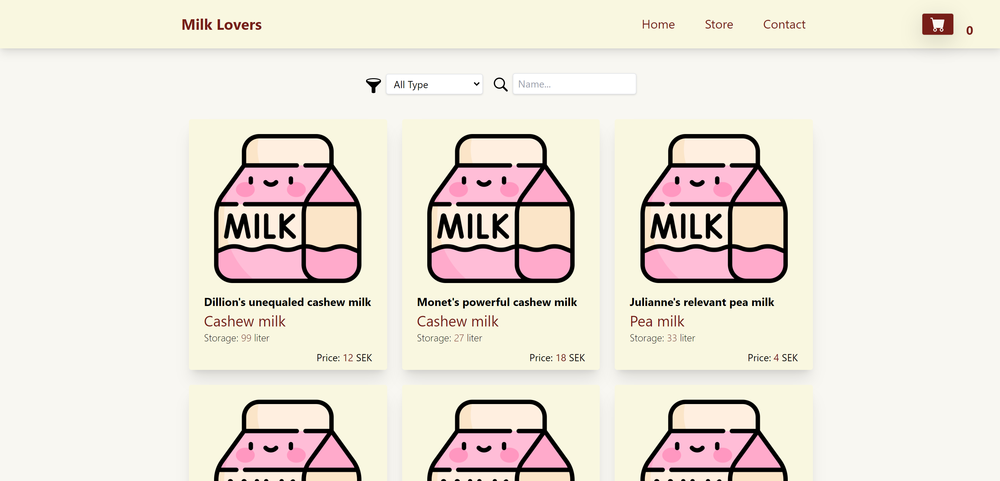

# Milk Lovers E-Commerce UI

The Milk Lovers E-Commerce UI is a fully responsive React.js-based project that provides a user interface for a shop where customers can purchase a variety of different types of milk. This project utilizes React.js hooks such as useState, useEffect, useContext, and useReducer for state management, along with Tailwind CSS for styling.

[Take a look](https://milk-lovers.netlify.app)





## Table of Contents

- [Features](#Features)
- [Installation](#Installation)
- [Project Structure](#ProjectStructure)
- [Dependencies](#Dependencies)
- [License](#license)

## Features

The Milk Lovers E-Commerce UI offers the following features:

1. Product Listing: View all available milk products with their names, descriptions, prices, and images.
2. Filtering and Searching: Filter milk products by type or search for specific products by name.
3. Product Details: View detailed information about a selected milk product.
4. Quantity Selection: Choose the desired quantity of milk in liters before adding it to the cart.
5. Cart Management: Add selected milk products to the cart, manage the quantity of each item, and remove products from the cart.
6. Responsive Design: The UI is designed to be responsive, ensuring a seamless experience across various devices and screen sizes.

## Installation

To get started with the Milk Lovers E-Commerce UI , follow these steps:

1. Clone the repository:

```bash
  git clone https://github.com/Luega/ReactTS-Milk_Lovers.git
```

2. Navigate to the project directory:

```bash
  cd /ReactTS-Milk_Lovers
```

3. Install the project dependencies:

```bash
  npm install
```

4. Set the environment variables in a .env file or as system environment variables.

```bash
REACT_APP_API_URL: The url on which the UI will fetch data from api.
```

5. Start the API server: Follow the instructions in the [API repository](https://github.com/Luega/ExpressTS-Milk_Lovers.git) to set up and run the API server.

6. Start the development server:

```bash
  npm run start
```

7. Open your browser and visit http://localhost:3000 to access.

Note: Please ensure that the API server is running before starting the Milk Shop UI application. The UI fetches data from the API to display milk products and perform various operations.

## Project Structure

The project follows a standard React.js structure, organized into various directories and files:

- src/components: Contains reusable UI components used throughout the project.
- src/context: Includes context providers and consumers for managing state and data.
- src/pages: Contains individual pages/routes of the application.
- src/utils: Includes utility functions and helpers.
- src/App.js: The main entry point of the application.
- src/index.js: Responsible for rendering the React application to the DOM.

## Dependencies

The Milk Shop UI project utilizes the following main dependencies:

- React.js: A JavaScript library for building user interfaces.
- Tailwind CSS: A utility-first CSS framework for rapid UI development.
- React Router: A popular routing library for handling navigation in React applications.

Please refer to the package.json file for a complete list of dependencies used in this project.

## License

This project is licensed under the [MIT](https://choosealicense.com/licenses/mit/) License.
